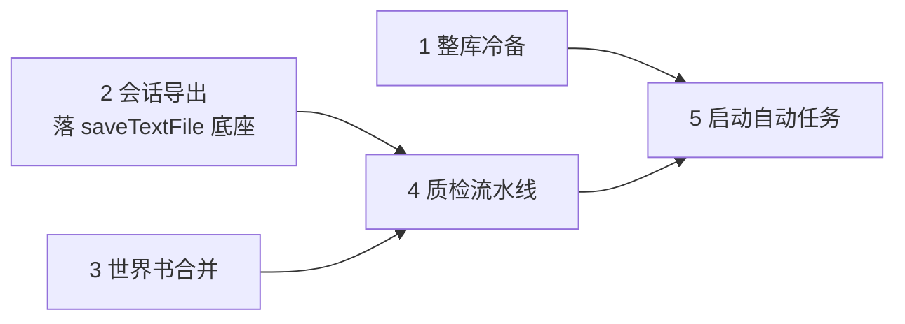

# 下次更新计划 — 五功能升级（冷备 · 合并 · 导出 · 质检 · 启动任务）

> 本文件是什么：下一版本的**总排期与索引**（5 项功能的顺序、依赖、验收口径与施工约定）。
> 与相邻文档的分工：本文只做「排期 + 索引」；每项功能的展开设计在各自小组的实现规格里（见 §五）。
> 最后更新：2026-10-03 ｜ 状态：✅ **五项全部落地（2026-10-03）**（发布动作待用户指令）｜ 版本号：发布时拍板（暂记 v2.3.6）

---

## 一、背景

v2.3.5 发布（2026-10-03）后，从功能建议评估中选定 5 项进入下一版本。选择标准：**不与既有功能/计划重复、全为增量、不触碰卡/书读写主链路**。

## 二、五功能一览

| # | 功能 | 规格文档（组内） | 价值 | 预估量级 | 依赖 |
| --- | --- | --- | --- | --- | --- |
| 1 | ✅ **整库冷备**（一键全量快照）**已落地 2026-10-03** | [`../功能规格/整库冷备-实现规格.md`](../功能规格/整库冷备-实现规格.md) | 数据安全底座：配置备份 / 单件快照 / 回收站之上的第四层 | 中 | — |
| 2 | ✅ **测试会话导出**（Markdown / HTML / 纯文本）**已落地 2026-10-03** | [`../测卡工作区/测试会话导出-实现规格.md`](../测卡工作区/测试会话导出-实现规格.md) | 测卡留档 / 分享；**顺带落地通用保存 IPC**（3、4 复用） | 低 | — |
| 3 | ✅ **世界书查重组一键合并** | [`../查重引擎/世界书合并-查重组一键合并-实现规格.md`](../查重引擎/世界书合并-查重组一键合并-实现规格.md) | 查重判定 → 合并执行的闭环；算法提取可测 | 中 | — |
 **已落地 2026-10-03** |
| 4 | ✅ **一键质检流水线** | [`../功能规格/一键质检流水线-实现规格.md`](../功能规格/一键质检流水线-实现规格.md) | 扫描→查重→标签→巡检→报告，一条流水线 | 中 | 2（`file:saveTextFile`）  **已落地 2026-10-03** |
| 5 | ✅ **启动自动任务** | [`../功能规格/启动自动任务-实现规格.md`](../功能规格/启动自动任务-实现规格.md) | 启动后可配的轻量巡检 / 冷备 / 查重 | 低 | 1、4（复用通道与统计）  **已落地 2026-10-03** |

## 三、建议实施顺序（三批）

- **批 1（互相独立，可并行/顺序皆可）**：2 会话导出 → 1 整库冷备 → 3 世界书合并；
- **批 2**：4 质检流水线（串起 1~3 的产物：报告导出、冷备建议、查重入口）；
- **批 3**：5 启动自动任务（最后做——它在编排层引用 1/4）。

每批完成后按项目铁律过三关：`get_errors` → `npm run build:web` → **真实启动冒烟**；计数活数字（用例数）当次同步。

## 四、施工约定（沿用项目铁律）

1. **读操作上真实库，写操作用隔离副本库**：冷备恢复演练、世界书合并演练、质检演练一律在副本库；真实库只做只读验证（大库压测库可全流程只读）；
2. **不引入新依赖**（无 zip / 无外部二进制）——冷备用目录直拷，导出用纯字符串模板；
3. **弹窗必须在 `App.vue` 顶层挂载**（fixed 定位历史坑）；新 `ctx` 字段两处同改（解构 + ctx 对象）；
4. **超长/大库场景**必须异步分批（让出主线程）+ 进度可视 + 可取消；
5. **文档联动**：每项落地后 —— `CHANGELOG.md`（内部）记实现细节；`RELEASE_NOTES.md`（对外）只写用户可感知变化；缺陷按 `docs/bugs` 规范先登记再修；
6. **测试**：新增纯函数（wbMerge / tagStats / cardAudit / chatExport）必须有单测；UI 走 CDP 探针 + 真实冒烟。

## 五、规格索引（唯一展开处）

| 组 | 文档 |
| --- | --- |
| 功能规格 | [整库冷备-实现规格.md](../功能规格/整库冷备-实现规格.md) · [一键质检流水线-实现规格.md](../功能规格/一键质检流水线-实现规格.md) · [启动自动任务-实现规格.md](../功能规格/启动自动任务-实现规格.md) |
| 查重引擎 | [世界书合并-查重组一键合并-实现规格.md](../查重引擎/世界书合并-查重组一键合并-实现规格.md) |
| 测卡工作区 | [测试会话导出-实现规格.md](../测卡工作区/测试会话导出-实现规格.md) |

## 六、本期不做（避免误开入口）

- AI 打标「待审队列 / 偏好映射 / 自定义模式转正」（建议清单中的未选项——待后续单独立项）；
- 多库快速切换、卡片质量巡检之外的更重功能；
- 「并发打标」「zip 冷备」「打包能力变更」等历史已决策/暂缓方向（见 [`后续升级计划.md`](后续升级计划.md)）。
